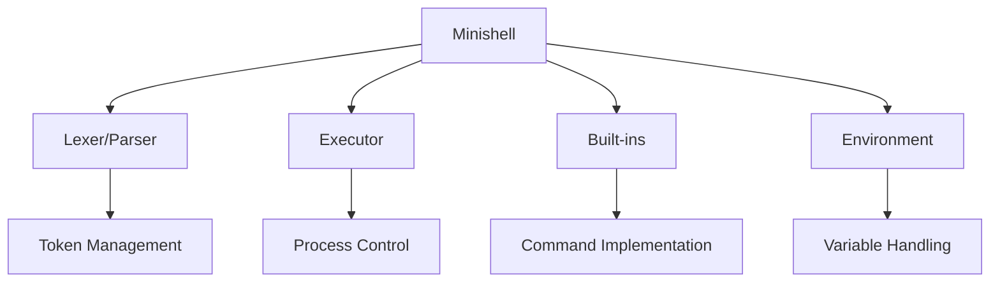

<div align="center">

# 🐚 Minishell

[](https://42.fr/en/homepage/)
[](https://opensource.org/licenses/MIT)

A lightweight shell implementation inspired by bash, built as part of the 42 school curriculum.

[Features](#features) •
[Installation](#installation) •
[Usage](#usage) •
[Commands](#commands) •
[Author](#author)

</div>

---

## 📋 Overview

Minishell is a custom implementation of a shell, providing essential command-line interface functionalities. It's designed to handle command execution, built-in commands, and environment management, offering a simplified yet powerful terminal experience.

## ✨ Features

- 💻 **Command Execution** - Execute commands with arguments
- 🔧 **Built-in Commands** - Essential shell commands implementation
- 🌳 **Environment Management** - Handle environment variables
- 📝 **Input/Output** - Support for redirections and pipes
- 📌 **Signal Handling** - Manage system signals
- 📚 **Command History** - Track and recall previous commands

## 🛠️ Technical Stack



## 📂 Project Structure

```
minishell/
├── 📁 includes/          # Header files
│   ├── 📄 minishell.h    # Main header
│   └── 📁 libft/         # Custom library
└── 📁 src/               # Source files
    ├── 📄 execution.c    # Command execution
    ├── 📄 builtin.c      # Built-in commands
    └── 📄 token.c        # Lexical analysis
```

## 🚀 Installation

```bash
# Clone the repository
git clone https://github.com/Nellaoui/Minishell.git

# Navigate to project directory
cd Minishell

# Compile the project
make
```

## 💻 Usage

```bash
./minishell
```

You'll be presented with a prompt where you can enter commands:

```bash
minishell$ echo "Hello, World!"
Hello, World!
minishell$ pwd
/Users/username/Minishell
```

## 🛠️ Built-in Commands

| Command | Description |
|---------|-------------|
| `echo` | Display text |
| `cd` | Change directory |
| `pwd` | Print working directory |
| `export` | Set environment variables |
| `unset` | Remove environment variables |
| `env` | Display environment |
| `exit` | Exit shell |

## 🔍 Error Handling

Minishell provides comprehensive error handling for various scenarios:

- Command not found
- Permission denied
- Invalid syntax
- Memory allocation failures

## 👤 Author

<div align="center">
    <a href="https://github.com/Nellaoui">
        
    </a>
    <h3>Nellaoui</h3>
    <a href="https://github.com/Nellaoui">
        
    </a>
</div>

---

<div align="center">
    <p>Made with ❤️ by Nellaoui</p>
    <p>© 2024 Minishell. All rights reserved.</p>
</div>
